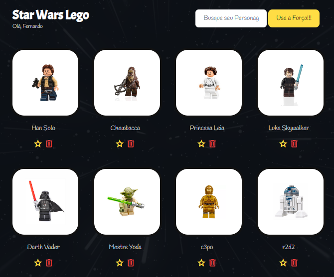

# Javascript para QA

Projeto com o foco de aprender mais sobre Javascript com o foco em qualidade de software. Auxilanado profissionais de QA a aprenderem sobre programação para adquirir maior facilidade na hora de elaborar testes automatizados com Javascript. 

## Star Wars Lego

Foi feito uma pagina com os personagens do Star Wars abordando os principais conceitos de lógicos por trás da elaboração de sites em Javascrit, HTML e CSS. 
 
Conceitos básicos de programação: Aprendemos a trabalhar com variáveis, constantes, funções, arrays, objetos, loops, operadores e controle de fluxo.

Introdução ao desenvolvimento web: Além do JavaScript, tivemos uma introdução prática a HTML e CSS, complementando nossa base para a criação de aplicações.

Criação de uma WebApp com Vue.js: Colocamos em prática o que aprendemos desenvolvendo uma aplicação web utilizando o framework Vue.js.

